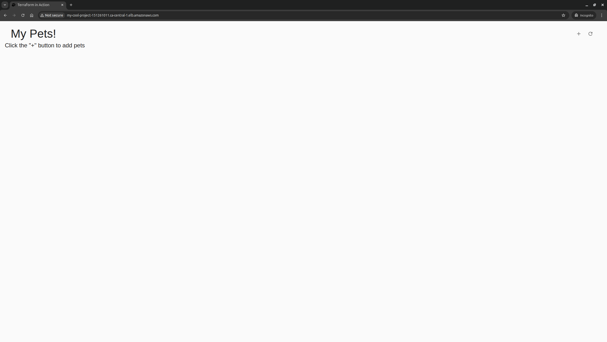

# Chapter 4: Modules and Abstraction

## Learning Goals

**Master Terraform modules for code organization and reusability:**
- Create custom modules with clear interfaces (variables and outputs)
- Consume community modules from Terraform Registry
- Understand module composition patterns
- Refactor monolithic configurations into modular components
- Balance using native resources vs. community modules

## Architecture

**3-tier web application deployed to AWS:**
- **Networking Layer:** VPC with public/private/database subnets across 3 AZs
- **Application Layer:** Autoscaling group with EC2 instances behind an Application Load Balancer
- **Data Layer:** RDS MySQL database in private subnets

**Key Infrastructure Components:**
- VPC with NAT gateway for private subnet internet access
- Security groups with least-privilege ingress/egress rules
- IAM roles and instance profiles for EC2 permissions
- Application Load Balancer with target group health checks
- Launch template with cloud-init for application deployment
- RDS MySQL database with automated password generation

## Module Structure

```
chapter_04/
├── main.tf                    # Root module - orchestrates child modules
├── variables.tf               # Input variables (namespace, ssh_keypair)
├── outputs.tf                 # Outputs (lb_dns_name, db_password)
├── versions.tf                # Provider and Terraform version constraints
└── modules/
    ├── networking/            # VPC, subnets, security groups
    │   ├── main.tf
    │   ├── variables.tf
    │   └── outputs.tf
    ├── database/              # RDS instance with random password
    │   ├── main.tf
    │   ├── variables.tf
    │   └── outputs.tf
    └── autoscaling/           # ALB, launch template, ASG
        ├── main.tf
        ├── variables.tf
        ├── outputs.tf
        └── cloud_config.yaml  # Cloud-init configuration
```

## Module Design Decisions

### Native Resources vs. Community Modules

**Used Native AWS Resources:**
- `aws_security_group` + `aws_security_group_rule` - Full control over security group rules
- `aws_iam_role`, `aws_iam_role_policy`, `aws_iam_instance_profile` - Explicit IAM setup
- `aws_db_instance` - Direct RDS configuration
- `random_password` - Generate secure database passwords

**Used Community Modules:**
- `terraform-aws-modules/vpc/aws` - Battle-tested VPC setup with sensible defaults
- `terraform-aws-modules/alb/aws` - Complex ALB configuration abstracted

**Rationale:** Native resources for educational value and fine-grained control; community modules for complex, well-established patterns.

## Exercise Walkthrough

### Prerequisites

```bash
# Set required variables
export TF_VAR_namespace="my-cool-project"
export TF_VAR_ssh_keypair="your-aws-keypair-name"
```

### Step 1: Initialize and Plan

```bash
# Initialize Terraform and download providers/modules
terraform init

# Output:
# Initializing modules...
# - autoscaling in modules/autoscaling
# - autoscaling.alb in terraform-aws-modules/alb/aws
# - database in modules/database
# - networking in modules/networking
# - networking.vpc in terraform-aws-modules/vpc/aws
#
# Initializing provider plugins...
# - terraform.io/hashicorp/aws v5.82.2
# - terraform.io/hashicorp/random v3.7.1
# - terraform.io/hashicorp/cloudinit v2.4.0

# Create and save execution plan
terraform plan -out=chapter04.tfplan

# Output:
# Plan: 59 to add, 0 to change, 0 to destroy.
#
# Changes to Outputs:
#   + db_password = (sensitive value)
#   + lb_dns_name = (known after apply)
```

### Step 2: Apply Infrastructure

```bash
# Apply the saved plan
terraform apply chapter04.tfplan

# Key resources created:
# - VPC with 3 public, 3 private, 3 database subnets
# - NAT gateway (single - cost optimization)
# - 3 security groups (load balancer, web server, database)
# - Application Load Balancer with HTTP listener
# - Target group for web servers (port 8080)
# - Launch template with Ubuntu 22.04 and cloud-init
# - Autoscaling group (min: 1, max: 3)
# - RDS MySQL 8.0 db.t3.micro instance
# - IAM role and instance profile for EC2

# Apply complete! Resources: 59 added, 0 changed, 0 destroyed.
#
# Outputs:
# db_password = <sensitive>
# lb_dns_name = "my-cool-project-151261011.ca-central-1.elb.amazonaws.com"
```

### Step 3: Test the Application

```bash
# Get the load balancer DNS name
terraform output lb_dns_name

# Test with curl
curl http://$(terraform output -raw lb_dns_name)

# Output: HTML response from "My Pets!" React application
# <!doctype html><html lang="en"><head><meta charset="utf-8">
# <title>Terraform in Action</title>...

# Access in browser
# http://<lb_dns_name>
```



### Step 4: Destroy Infrastructure

```bash
# Destroy all resources
terraform destroy -auto-approve

# Destroy complete! Resources: 59 destroyed.
```

## Key Learnings

### 1. Module Composition Pattern

**Data flows between modules through outputs:**

```hcl
# Root module orchestration (main.tf)
module "networking" {
  source    = "./modules/networking"
  namespace = var.namespace
}

module "database" {
  source    = "./modules/database"
  namespace = var.namespace
  vpc       = module.networking.vpc      # VPC data from networking module
  sg        = module.networking.sg       # Security groups from networking module
}

module "autoscaling" {
  source      = "./modules/autoscaling"
  namespace   = var.namespace
  vpc         = module.networking.vpc    # Shared VPC configuration
  sg          = module.networking.sg     # Shared security groups
  db_config   = module.database.db_config # Database connection info
}
```

**Key insight:** Modules encapsulate resources but expose data through outputs, enabling composition.

### 2. terraform validate vs. terraform plan

**Critical difference discovered:**

| Command | Checks | Queries AWS | Use Case |
|---------|--------|-------------|----------|
| `terraform validate` | Syntax, resource types, attribute names | ❌ No | Fast local validation |
| `terraform plan` | Everything validate does + data sources, output sensitivity, runtime values | ✅ Yes | Pre-apply verification |

**Example:** `validate` passed but `plan` failed when:
- Ubuntu 24.04 AMI didn't exist in region → fell back to 22.04
- RDS password contained invalid characters (`/`, `@`, `"`, `'`)
- db.t2.micro didn't support MySQL 8.0 → upgraded to db.t3.micro

### 3. Security Group Patterns

**Inline rules vs. separate resources:**

```hcl
# ❌ Inline blocks (doesn't work in modern AWS provider)
resource "aws_security_group" "example" {
  ingress {
    from_port   = 80
    to_port     = 80
    protocol    = "tcp"
    cidr_blocks = ["0.0.0.0/0"]
  }
}

# ✅ Separate rule resources (modern pattern)
resource "aws_security_group" "example" {
  name_prefix = "example-"
  vpc_id      = var.vpc_id
}

resource "aws_security_group_rule" "http_ingress" {
  type              = "ingress"
  from_port         = 80
  to_port           = 80
  protocol          = "tcp"
  cidr_blocks       = ["0.0.0.0/0"]
  security_group_id = aws_security_group.example.id
}
```

**Benefits:** More modular, easier to add/remove rules, avoids circular dependencies.

### 4. Partial Apply Recovery

**Terraform applies are NOT atomic.** If an apply fails midway:
- ✅ Successfully created resources remain in state
- ❌ Failed resources are not created
- ✅ Re-running plan shows only missing resources

**Example from our session:**
```bash
# First apply failed creating RDS (MySQL version incompatibility)
# Plan showed: 59 resources to add
# After partial failure: 56 resources created, 3 missing

# Fixed configuration, re-ran plan
# Plan showed: 3 to add (not 59!)
# Terraform only created the missing resources
```

**Key insight:** Terraform's state management handles partial failures gracefully—just fix the issue and re-apply.

### 5. Working with Community Modules

**terraform-aws-modules/alb v9.x specific patterns:**

```hcl
module "alb" {
  source  = "terraform-aws-modules/alb/aws"
  version = "~> 9.9.0"

  # Target groups configuration
  target_groups = {
    webservers = {
      port               = 8080
      protocol           = "HTTP"
      target_type        = "instance"
      create_attachment  = false  # Critical: ASG handles attachments
    }
  }

  # Listener forwards to target group
  listeners = {
    http = {
      port     = 80
      protocol = "HTTP"
      forward = {
        target_group_key = "webservers"
      }
    }
  }
}

# Autoscaling group automatically registers instances
resource "aws_autoscaling_group" "app" {
  target_group_arns = [for tg in module.alb.target_groups : tg.arn]
}
```

**Lesson learned:** Module v9.x changed target attachment behavior. Setting `create_attachment = false` prevents the module from trying to manually attach instances, allowing the ASG to handle it automatically.

### 6. Cost-Conscious Decisions

**Single NAT Gateway vs. Multi-AZ:**

```hcl
module "vpc" {
  source  = "terraform-aws-modules/vpc/aws"

  enable_nat_gateway = true
  # For production multi-AZ high availability: single_nat_gateway = false (~$97/mo)
  # For learning/cost savings: single_nat_gateway = true (~$32/mo)
  single_nat_gateway = true
}
```

**Trade-off:** Single NAT = single point of failure but 3x cheaper. Acceptable for dev/learning, not for production.

### 7. RDS Compatibility Constraints

**Learned through trial and error:**

| Instance Class | MySQL Version | Status |
|---------------|---------------|--------|
| db.t2.micro | 8.4.x | ❌ Not supported |
| db.t2.micro | 8.0.x | ❌ Deprecated |
| db.t3.micro | 8.0.x | ✅ Supported (free tier) |

**Also learned:** RDS password constraints exclude: `/`, `@`, `"`, `'`, and spaces.

```hcl
resource "random_password" "password" {
  length           = 16
  special          = true
  override_special = "!#$%^&*()-_=+[]{}|"  # RDS-safe characters only
}
```

## Terraform Workflow Commands

| Alias  | Full Command                      | Description                                      |
|--------|-----------------------------------|--------------------------------------------------|
| `tf`   | `terraform`                       | Base Terraform CLI                               |
| `tfi`  | `terraform init`                  | Initialize working directory                     |
| `tfiu` | `terraform init -upgrade`         | Upgrade providers to latest compatible versions |
| `tfp`  | `terraform plan`                  | Preview changes                                  |
| `tfa`  | `terraform apply`                 | Apply changes (with confirmation)                |
| `tfa!` | `terraform apply -auto-approve`   | Apply without confirmation                       |
| `tfd`  | `terraform destroy`               | Destroy infrastructure (with confirmation)       |
| `tfd!` | `terraform destroy -auto-approve` | Destroy without confirmation                     |
| `tfsh` | `terraform show`                  | Display state or saved plan                      |
| `tff`  | `terraform fmt`                   | Format `.tf` files                               |
| `tfv`  | `terraform validate`              | Validate syntax (local only)                     |

**Plan workflow with saved plans:**
```bash
terraform plan -out=chapter04.tfplan  # Save plan
terraform show chapter04.tfplan       # Review plan
terraform apply chapter04.tfplan      # Apply exact plan (no confirmation needed)
```

## Troubleshooting Guide

### Issue: AMI not found
```
Error: Your query returned no results.
  with module.autoscaling.data.aws_ami.ubuntu
```

**Solution:** AMI not available in your region. Update to a different Ubuntu LTS version:
```hcl
data "aws_ami" "ubuntu" {
  filter {
    name   = "name"
    values = ["ubuntu/images/hvm-ssd/ubuntu-jammy-22.04-amd64-server-*"]
  }
}
```

### Issue: RDS instance class not supported
```
Error: RDS does not support creating a DB instance with the following combination:
DBInstanceClass=db.t2.micro, Engine=mysql, EngineVersion=8.0.43
```

**Solution:** Use db.t3.micro (still free tier eligible):
```hcl
resource "aws_db_instance" "database" {
  instance_class = "db.t3.micro"
  engine_version = "8.0"
}
```

### Issue: Invalid RDS password characters
```
Error: The parameter MasterUserPassword is not a valid password.
Only printable ASCII characters besides '/', '@', '"', ' ' may be used.
```

**Solution:** Use RDS-safe special characters in random_password:
```hcl
resource "random_password" "password" {
  override_special = "!#$%^&*()-_=+[]{}|"  # Excludes / @ " ' and space
}
```

### Issue: ALB target group attachment error
```
Error: This object does not have an attribute named "target_id"
  with module.alb.aws_lb_target_group_attachment
```

**Solution:** Disable module-managed attachments when using ASG:
```hcl
target_groups = {
  webservers = {
    create_attachment = false  # Let ASG handle registration
  }
}
```

## Key Takeaways

1. **Modules enable code reuse** but require careful interface design (variables/outputs)
2. **Community modules save time** but you must understand their version-specific behavior
3. **Native resources give control** at the cost of more verbose configuration
4. **terraform plan is essential** - validate only checks syntax, not runtime behavior
5. **Partial applies are recoverable** - Terraform's state tracking handles failures gracefully
6. **Security groups should use separate rule resources** for modern AWS provider compatibility
7. **Cost optimization matters** even in learning environments (single NAT vs. multi-AZ)
8. **AWS compatibility evolves** - older instance types may not support newer software versions

## Next Steps

**Chapter 5** will introduce:
- Managing multiple environments (dev/staging/prod)
- Workspace-based environment separation
- Environment-specific variable files
- DRY principles across environments

**Key Question:** How do we deploy the same infrastructure to multiple environments without duplicating code?
