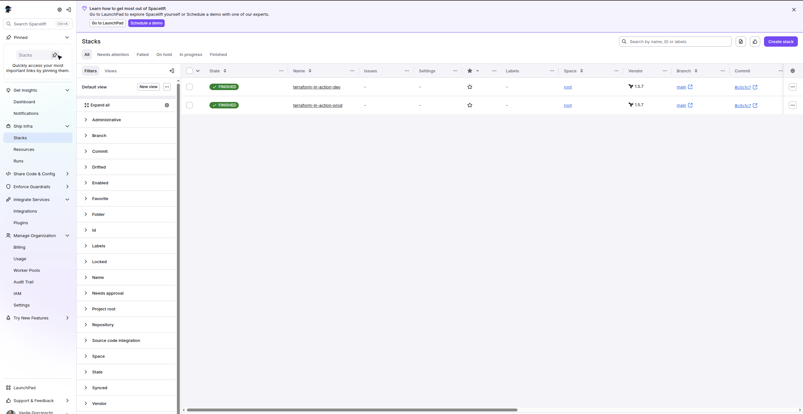
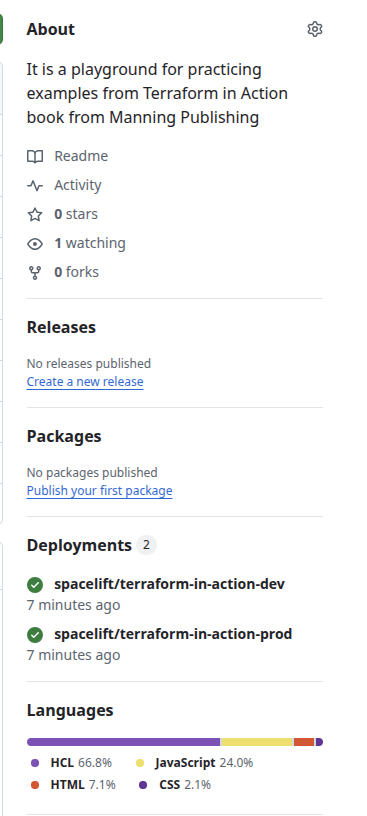

# Chapter 6: Team Workflows with Remote State

## Overview

This chapter explores Terraform team collaboration patterns and remote state management. While the book "Terraform in Action" focuses on using **S3 + DynamoDB for state locking**, this implementation uses a **Spacelift-based approach** that eliminates the need for distributed locking.

## Architectural Decision: Spacelift vs. DynamoDB Locking

### The Book's Approach (S3 + DynamoDB)

```
┌─────────────┐         ┌─────────────┐
│  Developer  │         │  Developer  │
│      A      │         │      B      │
└──────┬──────┘         └──────┬──────┘
       │                       │
       │  terraform apply      │  terraform apply
       │                       │
       v                       v
┌──────────────────────────────────────┐
│     DynamoDB Lock Table              │
│  (Pessimistic Concurrency Control)   │
│                                      │
│  ⚠️  Lock contention                 │
│  ⚠️  Orphaned locks                  │
│  ⚠️  Manual force-unlock             │
└──────────────────────────────────────┘
       │
       v
┌──────────────────────────────────────┐
│        S3 State Storage              │
└──────────────────────────────────────┘
```

**Characteristics:**

- **CP model** (Consistency + Partition tolerance)
- Distributed locking with lock contention
- Blocks concurrent operations on same workspace
- Requires manual intervention for orphaned locks
- Direct `terraform` CLI execution

### Our Approach (Spacelift + S3)

```
┌─────────────┐         ┌─────────────┐
│  Developer  │         │  Developer  │
│      A      │         │      B      │
└──────┬──────┘         └──────┬──────┘
       │                       │
       │  git push             │  git push
       │                       │
       v                       v
┌──────────────────────────────────────┐
│          GitHub Repository           │
└──────────────┬───────────────────────┘
               │ webhook
               v
┌──────────────────────────────────────┐
│        Spacelift Orchestrator        │
│   (Queue-Based Actor Model)          │
│                                      │
│  ✅ Sequential execution per Stack   │
│  ✅ No lock contention               │
│  ✅ Automatic retry on failure       │
│  ✅ PR-triggered plans               │
└──────────────┬───────────────────────┘
               │
               v
┌──────────────────────────────────────┐
│        S3 State Storage              │
└──────────────────────────────────────┘
```

**Characteristics:**

- **AP model** (Availability + Partition tolerance with eventual consistency)
- Queue-based execution (actor mailbox pattern)
- No distributed locks needed
- Single writer per workspace (the Spacelift agent)
- PR-driven workflow with plan previews

## Actor Model Analogy

For developers familiar with Akka or message-passing systems:

| Actor Model Concept   | Spacelift Equivalent                   |
| --------------------- | -------------------------------------- |
| Actor                 | Stack (workspace)                      |
| Mailbox               | Run queue                              |
| Message               | Terraform run (plan/apply)             |
| Supervisor            | Spacelift orchestrator                 |
| Sequential processing | Runs execute one at a time per Stack   |
| Parallel actors       | Multiple Stacks can run simultaneously |

**Key insight:** Each Stack is an actor with a mailbox (run queue). Commands are enqueued and processed sequentially. No locks needed because there's a single writer per Stack.

## Trade-Offs

| Aspect                 | DynamoDB Locking          | Spacelift                            |
| ---------------------- | ------------------------- | ------------------------------------ |
| **Cost**               | ~$0.50/month (DynamoDB)   | Free tier: 2 users, unlimited Stacks |
| **Setup Complexity**   | Low (1 table + S3 bucket) | Medium (GitHub app, account setup)   |
| **Lock Contention**    | Yes (explicit locks)      | No (queue-based)                     |
| **Orphaned Locks**     | Possible (manual unlock)  | Not applicable                       |
| **Concurrent Applies** | Blocked by lock           | Queued, execute sequentially         |
| **PR Integration**     | Manual (or custom CI)     | Built-in (plan on PR)                |
| **Audit Trail**        | CloudTrail logs           | Built-in run history                 |
| **Policy Enforcement** | External tools            | Built-in policies (OPA, Sentinel)    |
| **CLI Workflow**       | Direct `terraform`        | Via Spacelift API or UI              |

### Other Options

- **Terraform Cloud:** HashiCorp's managed offering (similar to Spacelift)
- **Atlantis:** Self-hosted PR automation (middle ground)
- **GitLab/GitHub CI + S3/DynamoDB:** DIY approach

## Repository Structure

```
chapter_06/
├── README.md                    # This file
├── modules/
│   └── s3-backend/              # Reusable S3 backend module
│       ├── main.tf              # S3 bucket for state storage
│       ├── variables.tf         # Input variables
│       ├── outputs.tf           # Bucket name, region, etc.
│       └── README.md            # Module documentation
├── backend-bootstrap/           # One-time setup (creates S3 bucket)
│   ├── main.tf                  # Uses LOCAL state (chicken-egg problem)
│   ├── outputs.tf               # Outputs bucket name for workspaces
│   └── terraform.tfstate        # ⚠️ COMMITTED (exception to rule)
├── workspaces/
│   ├── dev/                     # Dev environment
│   │   ├── main.tf              # Example infrastructure
│   │   ├── backend.tf           # S3 backend configuration
│   │   └── variables.tf
│   └── prod/                    # Prod environment
│       ├── main.tf              # Example infrastructure
│       ├── backend.tf           # S3 backend configuration
│       └── variables.tf
└── .spacelift/                  # Spacelift configuration (optional)
    └── config.yml               # Stack configuration as code
```

## Spacelift Configuration

**Location:** `/.spacelift/config.yml` (repository root, not chapter_06/)

**Configured stacks:**

- `terraform-in-action-dev` → points to `chapter_06/workspaces/dev/`
- `terraform-in-action-prod` → points to `chapter_06/workspaces/prod/`

**How it works:**

1. Merge PR to `main` with `.spacelift/config.yml`
2. Spacelift detects config and auto-creates stacks
3. Future PRs affecting `chapter_06/workspaces/*` trigger plans on respective stacks
4. Merge PR → manual confirm in Spacelift UI → apply

**Benefits of GitOps approach:**

- Stack configuration is version controlled
- Changes visible in PRs (infrastructure-as-code for CI/CD)
- Auditable via git history
- Replicable across environments
- Production-grade pattern

### Manual Confirmation (Safety Feature)

By default, Spacelift requires **manual confirmation** before applying changes:

```
PR Merged → Plan runs automatically → "Unconfirmed" state → Human clicks "Confirm" → Apply runs
```

This prevents accidental infrastructure changes. After merging a PR, you'll see:

- Stack status: **Unconfirmed**
- Buttons: **Confirm** / **Discard**

Click **Confirm** to proceed with `terraform apply`, or **Discard** to reject the changes.

**To enable auto-apply** (skip manual confirmation):

```yaml
# .spacelift/config.yml
stacks:
  terraform-in-action-dev:
    project_root: "chapter_06/workspaces/dev"
    terraform_version: "1.5.7"
    autodeploy: true  # Auto-apply after successful plan
```

**Recommendation:** Keep manual confirmation for production stacks, enable auto-apply only for dev/ephemeral environments.

## Critical Distinction: What Runs Where

**backend-bootstrap: Run LOCALLY (not Spacelift)**

- Creates the S3 bucket for state storage
- Uses LOCAL state file (chicken-egg problem)
- Run ONCE manually with `terraform apply`
- Committed to git (exception to "never commit state" rule)
- Why: Spacelift needs the bucket to exist before it can use it

**workspaces/dev & workspaces/prod: Run via SPACELIFT**

- Use REMOTE state in the S3 bucket created above
- Managed by Spacelift Stacks
- PR → plan, merge → manual confirm → apply
- This is where the PR-driven workflow happens
- Why: Real infrastructure with proper state management

## Implementation Steps

### Phase 1: Bootstrap S3 Backend (RUN LOCALLY)

1. Create S3 bucket for state storage (using local state)
2. Run `terraform apply` from your machine (NOT Spacelift)
3. Commit the resulting `terraform.tfstate` file to git
4. Output bucket details for workspace configuration

### Phase 2: Create Workspaces (CODE ONLY - Don't Apply)

1. Create dev workspace Terraform code (simple infrastructure)
2. Create prod workspace Terraform code (similar infrastructure)
3. Configure each to use remote S3 backend with different state keys
4. Push to GitHub branch (don't run terraform apply locally)

### Phase 3: Spacelift Setup (SPACELIFT RUNS THE CODE)

1. Connect GitHub repository to Spacelift (already done)
2. Create Stack for dev workspace (points to workspaces/dev/)
3. Create Stack for prod workspace (points to workspaces/prod/)
4. Configure triggers (PR-based plan, manual apply)

### Phase 4: Test Workflow (PR-DRIVEN)

1. Make change to dev workspace via PR
2. Spacelift automatically runs plan, posts results to PR
3. Merge PR after reviewing plan
4. Manually confirm apply in Spacelift UI
5. Repeat for prod workspace
6. Verify state isolation between workspaces

## Key Concepts from Chapter 6

Even though we're using Spacelift, these concepts from the book remain important:

1. **Remote State Storage:** S3 stores state files (Spacelift orchestrates access)
2. **State Isolation:** Separate state files per environment (dev vs prod)
3. **Backend Configuration:** Each workspace configures S3 backend
4. **Output Sharing:** Use `terraform_remote_state` data source to share outputs between workspaces
5. **Module Publishing:** Reusable modules (s3-backend) accessible across workspaces

## Cost Considerations

**S3 State Storage:**

- State files are tiny (few KB to few MB)
- S3 free tier: 5GB storage, 20,000 GET requests/month
- **Estimated cost:** < $0.10/month for state storage

**Spacelift:**

- Free tier: 2 users, unlimited Stacks, 500 tracked resources
- **Estimated cost:** $0 for this learning exercise

**Infrastructure Resources (dev/prod):**

- Using minimal resources (t3.micro, small S3 buckets)
- **Estimated cost:** < $5/month if left running
- **Strategy:** Destroy immediately after testing

**Total:** < $5/month, free if cleaned up daily

## Distributed Systems Perspective

From a distributed systems lens, this chapter explores:

**Concurrency Control:**

- **Pessimistic (DynamoDB locks):** Assume conflicts, prevent concurrent writes
- **Optimistic (Spacelift queues):** Assume no conflicts, serialize via single writer

**Consistency Models:**

- **DynamoDB approach:** Strong consistency via locking (CP system)
- **Spacelift approach:** Eventual consistency with queue ordering (AP system)

**Fault Tolerance:**

- **DynamoDB:** Lock timeout + manual recovery
- **Spacelift:** Automatic retry + run history

**Actor Model:**

- Each Stack = actor with mailbox
- Messages = Terraform runs
- Sequential processing per actor
- Parallel execution across actors

This mirrors patterns you've seen in Akka, Erlang/OTP, and message queue systems.

### Successful Spacelift Run

After fixing the provider configuration:

**Plan phase:**

```
Initializing the backend...
Successfully configured the backend "s3"!

Initializing provider plugins...
- Installing hashicorp/aws v5.100.0...
- Installed hashicorp/aws v5.100.0 (signed by HashiCorp)

Terraform has been successfully initialized!

Plan: 1 to add, 0 to change, 0 to destroy.
```

**Apply phase (after clicking Confirm):**

```
Applying changes...
aws_s3_bucket.prod_bucket: Creating...
aws_s3_bucket.prod_bucket: Creation complete after 1s [id=prod-example-20260115232510259900000001]

Apply complete! Resources: 1 added, 0 changed, 0 destroyed.

Changes applied successfully
Uploading the list of managed resources...
Resource list upload is GO
```

**Both stacks successfully deployed:**



Both `terraform-in-action-dev` and `terraform-in-action-prod` stacks show **FINISHED** status, each managing their respective S3 bucket with isolated state files.

**GitHub Deployments Integration:**



Spacelift registers deployments with GitHub's Deployments API, providing visibility directly in the repository. This completes the **GitOps Infrastructure CD** loop:

1. **Git as source of truth** → Infrastructure defined in code
2. **PR-triggered plans** → Preview changes before merge
3. **Merge triggers deployment** → Spacelift applies changes
4. **GitHub tracks deployments** → Full audit trail in repository

This is true Infrastructure Continuous Deployment - code changes flow automatically from PR → merge → deploy, with the repository serving as the single source of truth for both application and infrastructure state.
